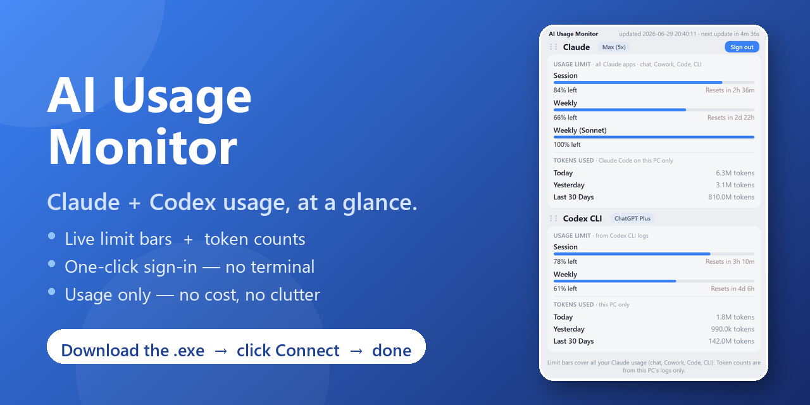
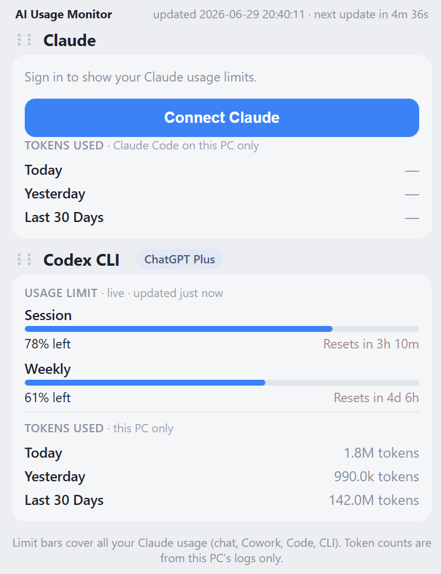
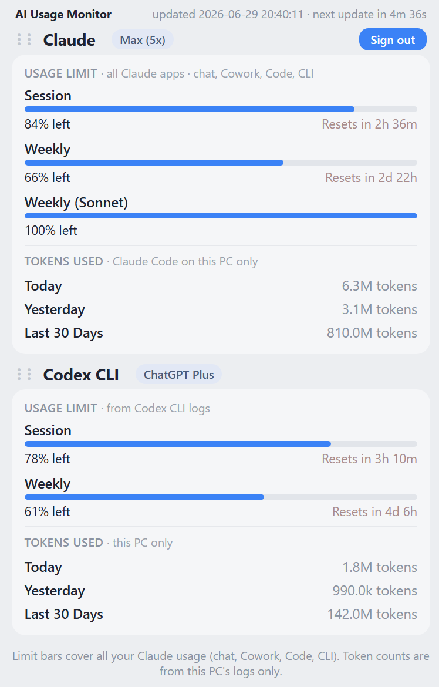

# AI Usage Monitor (Claude + Codex)

  

A tiny desktop **widget** for Windows that shows, at a glance, how much of your
**Claude** and **Codex (ChatGPT)** usage you have left — as easy-to-read bars —
plus how many tokens you have used today, yesterday, and over the last 30 days.

No cost figures, no clutter. It opens in its own little window and stays out of
your way.

<table>
<tr>
<td align="center"><b>1. First time — click “Connect Claude”</b></td>
<td align="center"><b>2. After you sign in</b></td>
</tr>
<tr>
<td></td>
<td></td>
</tr>
</table>

---

## Get it running (the easy way — no setup)

You only need the ready-made program. **You do not need to install Python or use
any terminal.**

1. **Download `AIUsage.exe`** from the
   [latest release](https://github.com/halimadmech/ai-usage-monitor/releases/latest)
   (under **Assets**).
2. **Double-click `AIUsage.exe`.** A small window opens.
   - Windows may show a blue **“Windows protected your PC”** box (this appears for
     any new app that isn’t code-signed). Click **More info → Run anyway**. It is
     safe — the full source code is right here in this repository.
3. **Click the blue “Connect Claude” button** (see screenshot 1). Your web browser
   opens and asks you to sign in to your Claude account. Sign in, and you’re done —
   the usage bars fill in by themselves after a few seconds (screenshot 2).

That’s it. Leave the window open whenever you want to keep an eye on your usage.

> **Codex (ChatGPT) usage shows up on its own** — no sign-in needed for that part,
> as long as you have used the Codex CLI on this computer.

## What the numbers mean (important)

- **The bars (the “% left”)** come straight from Anthropic’s servers. They cover
  **everything you do with Claude** — the Claude chat app, Claude in the browser,
  Cowork, Claude Code, and the command line — all added together. This is the best
  number for *“how much have I used this week?”*
- **The token counts** (Today / Yesterday / Last 30 Days) are added up from logs
  saved on **this computer only**. So they show your Claude Code and Codex usage on
  this PC. They **do not** include your Claude *chat* usage, because that is never
  saved on your computer.

So if a token row shows “—” but the bars have moved, that’s normal — it just means
that usage happened in the Claude chat app, which the bars already count.

## Runs like a normal app (tray + mini widget)

- **System tray icon.** Closing the window (the **✕**) doesn’t quit — it tucks the
  app into your system tray (bottom-right, by the clock). **Right-click the tray icon**
  for **Open**, **Mini widget**, and **Exit**. Only **Exit** closes it completely.
- **Taskbar widget.** A tiny bar that sits **on your taskbar** showing just your
  **Claude %** and **Codex %** on two lines (on by default; toggle from the tray).
  **Hover** it to pop open the full view; move the mouse away and it shrinks back.
  **Drag** it to the exact empty spot you like on the taskbar, then right-click the
  tray icon and pick **Lock widget position** to pin it there. It remembers where
  you put it.
  > Windows 11 removed the old "in the taskbar" widget API, so this rides *on top of*
  > the taskbar (always visible, styled to blend in) rather than being embedded in it.
- **Only one copy runs at a time.** Opening the app again while it's already
  running (even minimized to the tray) just brings the existing window forward —
  it won't start a second app or a second tray icon.

## Signing in and out

- **Connect Claude** runs the official Claude sign-in for you. It uses the Claude
  program already on your PC (the Claude desktop app, which most people have, or
  the Claude command-line tool). **The app never sees your password** — you log in
  on Anthropic’s own website in your browser.
- If it says Claude was **not found**, install the
  [Claude desktop app](https://claude.ai/download) and click Connect again.
- A blue **Sign out** button appears on the Claude card once you’re signed in.
- If the card ever says **“session expired”**, just click **Connect Claude** again.

## What you need

- **Windows 11** (the widget uses the Edge WebView runtime that comes with it).
- A **Claude Pro, Max, or Team** subscription, for the Claude bars.
- The **Claude desktop app** (or the Claude CLI) installed, so the one-click
  sign-in has something to launch.

## Frequently asked

**Is it safe / private?** Yes. Everything stays on your computer. The only thing
sent over the internet is your own usage check to Anthropic — the exact same
request Claude Code already makes — and the sign-in, which happens on Anthropic’s
website. The app has no servers of its own.

**Does it cost anything or use API credits?** No. It reads your subscription usage;
it does not call any paid API.

**Why no dollar amounts?** By design — this widget is about *usage* (percentages
and tokens), not billing.

---

## For developers — build it yourself

You only need this if you want to change the code or build the `.exe` from source.

- **Run from source:** install [Python 3](https://www.python.org/downloads/)
  (tick *“Add python.exe to PATH”*), then double-click `START.bat`, or run
  `py usage_monitor.py`.
- **Build the exe:** double-click `build_exe.bat`. The result is
  `dist\AIUsage.exe`.
- **The whole app is one file:** [`usage_monitor.py`](usage_monitor.py). Useful
  settings live at the top — `WINDOW_FRACTION` (height as a share of the screen),
  `WINDOW_WIDTH`, `ALWAYS_ON_TOP`, and the refresh timing.

### How the data is sourced

- **Claude bars:** Claude Code’s own usage endpoint, called with the login token
  the official Claude sign-in saves in `~/.claude/.credentials.json`. Polled gently
  (about every 5 minutes). Because it’s tied to your subscription, it counts all
  Claude surfaces (chat, Cowork, Code, CLI).
- **Claude tokens:** Claude Code’s local session logs on this PC.
- **Codex bars:** read **live** from the official `codex app-server`’s
  `account/rateLimits/read` (the same account read the Codex desktop app uses — an
  account-status call, not a model request, so it costs no quota). If the Codex CLI
  isn’t installed, it falls back to the last snapshot in the local logs, labelled
  with its age. The plan badge comes from the live read (or the local login file).
- **Codex tokens:** the Codex CLI’s local logs on this PC.

### Troubleshooting the Claude bars

Run `AIUsage.exe --test-claude` (or `py usage_monitor.py --test-claude`). It writes
`usage_monitor_claude_test.txt` to your user folder and opens it, showing whether
the login token was found and what the usage server returned.
